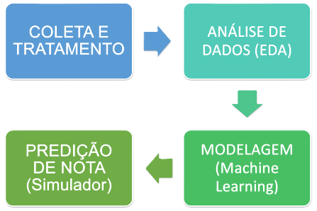
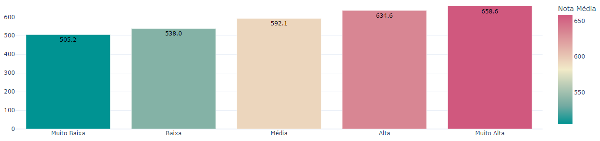
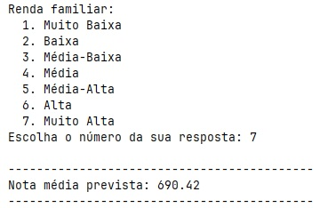

# ENEM - Análise de dados socioeconômicos e predição de média do usuário


> Projeto de extensão para a disciplina "Tópicos de Big Data em Python".

---

## 📌 Sobre o Projeto

Este projeto investiga como a desigualdade social influencia o desempenho no Exame Nacional do Ensino Médio (ENEM). Utilizando microdados públicos do INEP (com ~4 milhões de registros), desenvolvemos um pipeline de Ciência de Dados para tratar, analisar e modelar esses dados, resultando em uma base limpa com ~2 milhões de registros relevantes para o projeto.

O objetivo final foi a criação de um **Simulador de Nota Média** capaz de predizer o desempenho de um usuário com base em apenas 10 indicadores socioeconômicos.

> 🚀 **Testar Online:** Acesse a versão com interface gráfica do simulador interativo diretamente no navegador:
> 👉 [**https://enem-2023-predicao.streamlit.app/**](https://enem-2023-predicao.streamlit.app/)

---

### 👥 Autores
* **Clenilton** (Modelagem ML e Interface Gráfica)
* **Misael** (Coleta e Tratamento)
* **Solário** (Simulador pelo terminal)
* **Vitor** (Análise de Dados/EDA)
* **Kairos** (Documentação)

---

## 🛠️ Pipeline do Projeto

O projeto seguiu o fluxo clássico de KDD (Knowledge Discovery in Databases):



1.  **Coleta e Tratamento:** Limpeza de ~1.7GB de dados brutos para ~250MB e engenharia de features.
2.  **Análise de Dados (EDA):** Estudo visual das correlações (Renda, Tipo de Escola, etc.).
3.  **Modelagem (Machine Learning):** Treinamento e otimização de modelos (Linear, RF, LightGBM) e Clustering (MiniBatchKMeans).
4.  **Predição de Nota (Simulador):** Desenvolvimento de interface via terminal para predição de nota média.

---

## 📊 Análise e Resultados

A análise confirmou a forte correlação entre fatores socioeconômicos e desempenho. 

Abaixo, a distribuição da nota média por categoria socioeconômica:



> Quanto maior a categoria socioeconômica, maior a nota média observada. Isso reforça a influência dos fatores sociais no desempenho dos participantes.

### 📐 Métricas utilizadas

| Modelo | MAE (Erro Médio Absoluto) | R² (Variância Explicada) | Acurácia (Derivada do MAPE) |
| :--- |:-------------------------:|:------------------------:|:------------------------:|
| Regressão Linear |           58.06           |          34.94%          |          88.88%          |
| Random Forest |           57.24           |          36.53%          |          89.04%          |
| **LightGBM (Escolhido)** |         **57.04**         |        **37.06%**        |          **89.08%**          |

> **Insight:** Com os modelos escolhidos, variáveis socioeconômicas observáveis explicam ~37% da variação da nota média no conjunto de dados usado. Isso indica uma influência relevante, mas ~60% da variação permanece não explicada por essas variáveis e pode decorrer de fatores individuais, como motivação, ou de medida não observados.

> ℹ️ **Nota sobre a métrica de acurácia:**  
> Como trabalhamos com regressão, a acurácia foi definida de forma personalizada como `1 - MAPE`.  
> Exemplo: se a nota real for 1000 e a acurácia for 90%, o modelo pode ter previsto 900.

---

## 💻 Como Executar o Projeto

### Pré-requisitos
* Python 3.10+

### Instalação
1) Criar e ativar o ambiente virtual:

```bash
python -m venv .venv
.venv\Scripts\Activate
```

2) Instalar dependências:

```bash
pip install -r requirements.txt
```

---

## ⚡ Uso rápido

### 🌐 Opção 1: Simulador Web (Sem Instalação)
Para testar a IA imediatamente através da interface gráfica:
[**Clique aqui para abrir o Web App ↗**](https://enem-2023-predicao.streamlit.app/)

### 💻 Opção 2: Rodar Localmente (Terminal)
- 🎯 Para testar o Simulador via linha de comando:

```bash
python scripts/inputs.py
```
## 🔄 Para reproduzir todo o processo (Do zero)

1) Gerar a base de dados limpa (Requer os microdados brutos na pasta dados/enem_2023.csv):

```bash
python scripts/filtragem_inicial.py
```
>RAM recomendada: 16–32GB
2) Treinar os modelos (Gera os arquivos .joblib em `./modelos`):

```bash
python scripts/treino_modelos.py
```

---

## 🚀 Demonstração (Simulador)


---

## 📂 Estrutura do Projeto

- `dados/` — bases de dados:
  - `enem_2023_limpo.zip` — bases do ENEM tratada e compactada.
  - `municipios_rm_limpo.csv` — municípios que compõem regiões metropolitanas (tratamento do recorte do IBGE).
- `evidencias/` prints, gráficos e resultados por integrante
- `scripts/` — scripts executáveis:
  - `filtragem_inicial.py` — limpeza e filtragem inicial dos microdados.
  - `treino_modelos.py` — pipeline de treino e salvamento de modelos (salva em `./modelos`).
  - `inputs.py` — script de predição interativo que solicita inputs socioeconômicos do usuário.
- `modelos/` — modelos treinados
- `notebooks/` — análises e gráficos exploratórios.

---

## 🏛️ Fontes dos dados 

- INEP — Microdados ENEM 2023:
  - https://www.gov.br/inep/pt-br/acesso-a-informacao/dados-abertos/microdados/enem
  - Acessado em: 19/11/2025.
  
- IBGE — Recortes Metropolitanos e Aglomerações Urbanas:
  - https://www.ibge.gov.br/geociencias/organizacao-do-territorio/divisao-regional/18354-recortes-metropolitanos-e-aglomeracoes-urbanas.html
  - Acessado em: 19/11/2025.